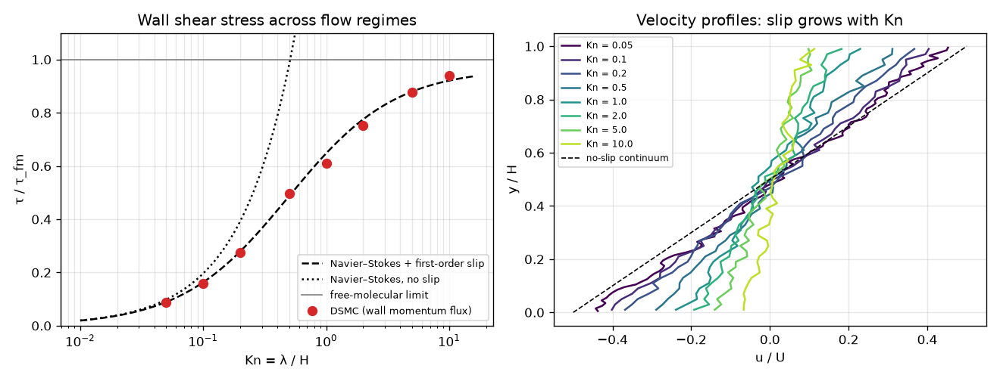
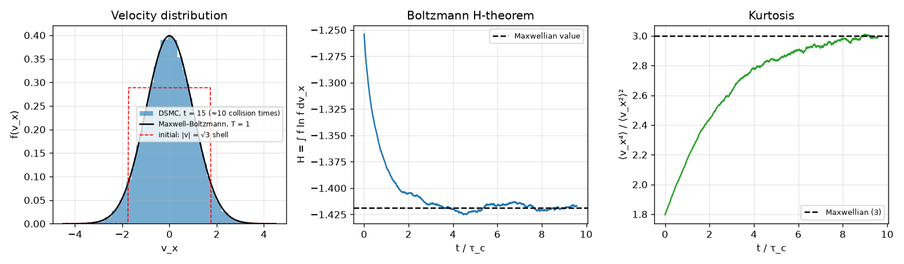
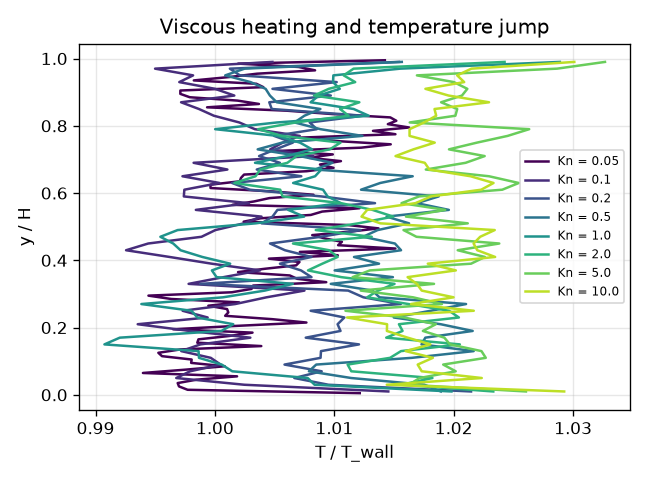

# DSMC: Direct Simulation Monte Carlo for Rarefied Gas

[](https://github.com/cfdgasman/dsmc-rarefied-gas/actions/workflows/ci.yml)

A compact, readable **DSMC** code (Bird's method) for a hard-sphere gas, in NumPy. It is verified on two classic problems:
- **relaxation to equilibrium**, checking the Boltzmann H-theorem and the collision rate
- **planar Couette flow** from the slip regime all the way to free-molecular flow

<p align="center"></p>

## What DSMC does

DSMC solves the Boltzmann equation stochastically. Each simulated particle represents F<sub>N</sub> real molecules. Each time step Δt is split into:

1. **Move.** Particles fly ballistically, **x** ← **x** + **v**Δt, and walls are applied: *diffuse* reflection re-emits a molecule from a wall Maxwellian at the wall temperature and velocity. The wall-normal component is sampled from the flux-weighted distribution v<sub>n</sub> = √(−2kT<sub>w</sub>/m · ln R).
2. **Index.** Particles are sorted into cells smaller than the mean free path.
3. **Collide** (No-Time-Counter scheme). In a cell with N<sub>c</sub> particles and volume V<sub>c</sub>, choose

   $$ N_{\rm cand} = \tfrac12 N_c(N_c-1)\,F_N\,(\sigma g)_{\max}\,\Delta t / V_c $$

   random candidate pairs and accept each with probability g/g<sub>max</sub>. For hard spheres, scattering is isotropic in the centre-of-mass frame: **v**<sub>1,2</sub>′ = **v**<sub>cm</sub> ± ½ g **n̂** with **n̂** uniform on the sphere. Momentum and energy are conserved exactly, which the tests check.
4. **Sample** cell moments: n, **u**, T and the kinetic stress P<sub>xy</sub> = n⟨v′<sub>x</sub>v′<sub>y</sub>⟩.

**Units:** m = k = T<sub>ref</sub> = n<sub>ref</sub> = 1. Hard-sphere relations:

$$ \lambda = \frac{1}{\sqrt2\,\pi d^2 n},\qquad \mu = \frac{5}{16 d^2}\sqrt{\frac{mkT}{\pi}}. $$

## Results

### 1. Relaxation to equilibrium

A homogeneous gas starts with every molecule at the same speed √3 in a random direction, a "shell" distribution that is far from Maxwellian.

<p align="center"></p>

- The collision rate matches hard-sphere kinetic theory, ½ N n σ⟨g⟩ with ⟨g⟩ = 4√(kT/πm), to **0.07 %**.
- H = ∫f ln f decreases monotonically to its Maxwellian value, as the **H-theorem** requires. The kurtosis rises from 1.8 to **2.99**, against 3 for a Maxwellian.

### 2. Planar Couette flow, Kn = 0.05 → 10

Diffuse walls at y = 0 and y = H move at ∓U/2 (U = 0.4) with T<sub>w</sub> = 1. Kn = λ/H.

The DSMC results are compared with two exact limits:

- **Navier–Stokes with first-order velocity slip.** τ = μU/(H + 2ζλ), with ζ = 1.016.
- **Free-molecular flow.** τ<sub>fm</sub> = nU√(kT/2πm): molecules carry the full wall velocity across the gap without colliding.

| Kn | τ/τ<sub>fm</sub> (DSMC wall) | τ/τ<sub>fm</sub> (DSMC bulk P<sub>xy</sub>) | NS + slip | wall slip u<sub>s</sub>/U |
|---|---|---|---|---|
| 0.05 | 0.089 | 0.079 | 0.089 | 0.06 |
| 0.1 | 0.159 | 0.163 | 0.163 | 0.10 |
| 0.2 | 0.276 | 0.271 | 0.279 | 0.13 |
| 0.5 | 0.498 | 0.491 | 0.487 | 0.21 |
| 1 | 0.611 | 0.608 | 0.648 | 0.26 |
| 2 | 0.751 | 0.755 | 0.776 | 0.31 |
| 5 | 0.877 | 0.876 | 0.880 | 0.36 |
| 10 | 0.940 | 0.938 | 0.921 | 0.43 |

- **Slip regime (Kn ≲ 0.5):** DSMC agrees with Navier–Stokes + slip within about **2 %**. Plain no-slip Navier–Stokes overestimates the stress badly once Kn ≳ 0.1.
- **Transition regime (Kn ≈ 1):** slip theory is 6 % off, because Navier–Stokes itself no longer holds there.
- **Near free-molecular (Kn = 10):** the stress approaches τ<sub>fm</sub>, and the velocity profile flattens into large jumps at the walls.
- The wall momentum flux and the bulk kinetic stress agree, as momentum conservation requires. At Kn = 0.05 the bulk estimate is noisier because the signal is small.

<p align="center"></p>

Viscous heating raises the core temperature. At higher Kn a **temperature jump** appears at the walls: the gas next to the wall is hotter than the wall itself.

### A lesson from debugging

The first Couette runs gave a viscosity about 20 % too low. A separate **shear-wave decay** test (periodic box, ∂<sub>t</sub>u = νu<sub>yy</sub>) confirmed that DSMC reproduces the hard-sphere viscosity within 1–3 % once Δt and Δy are well resolved. The real culprit was the **start-up transient**: sampling began long before the flow had relaxed over the viscous time H²/(π²ν). Each run now sizes its transient from that time scale and starts from a slip-corrected profile.

## Usage

```bash
pip install -r requirements.txt
python run.py      # relaxation + Couette sweep (~12 min), figures in docs/
pytest             # conservation, collision rate, transport-property consistency, free-molecular limit
```

## References

G. A. Bird, *Molecular Gas Dynamics and the Direct Simulation of Gas Flows*, Clarendon Press, 1994.
C. Cercignani, *Rarefied Gas Dynamics: From Basic Concepts to Actual Calculations*, Cambridge University Press, 2000.
F. J. Alexander, A. L. Garcia, B. J. Alder, *Cell size dependence of transport coefficients in stochastic particle algorithms*, Phys. Fluids 10 (1998) 1540.

## License

MIT
